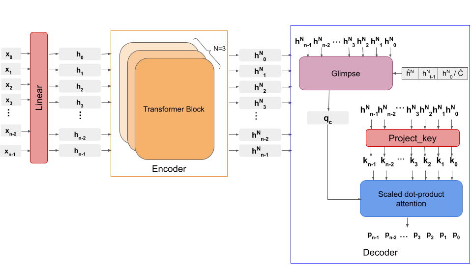
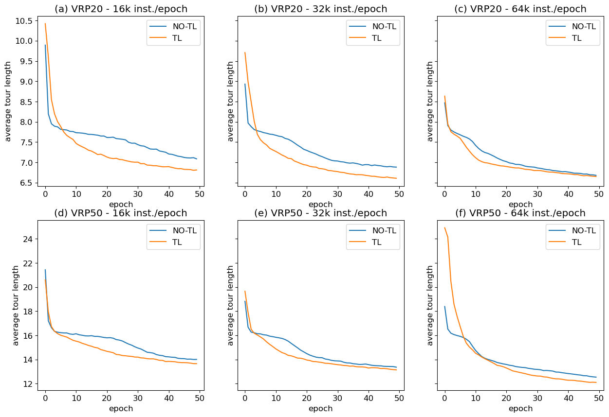

# Is  Transfer  Learning  helpful  for  Neural  Combinatorial  Optimization applied to Vehicle Routing Problems?

This repository contains our code and results of our experiments on applying transfer learning in the case of neural combinatorial optimisation applied for routing problems. Our use case is transferring the routing policy learned in the case of TSP to the CVRP. The paper is available in the following [link](http://147.213.75.17/ojs/index.php/cai/article/view/2022_1_172)

The model used is a personal implementation of [Attention Model](https://github.com/wouterkool/attention-learn-to-route) with small modifications in order to have the same number of parameters learned between the problems.



Some of our findings suggest that when using transfer learning from TSP to CVRP, there is a speed up in learning when a relatively small number of instances are used per epoch.



To cite this work:
```
@article{yaddaden2022transfer,
  title={Is Transfer Learning Helpful for Neural Combinatorial Optimization Applied to Vehicle Routing Problems?},
  author={Yaddaden, Ali and Harispe, Sebastien and Vasquez, Michel},
  journal={Computing and Informatics},
  volume={41},
  number={1},
  pages={172--190},
  year={2022}
}

```
